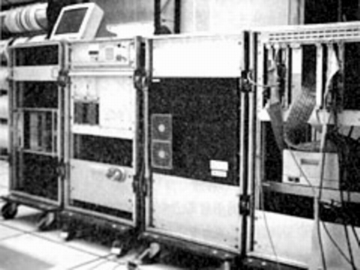
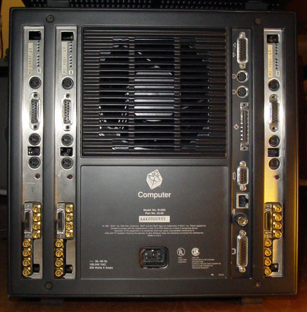

# ssaw130415

## Sound and Software art Workshop(SSAW13)について

Sound and Software Art Workshop(SSAW)は、火曜3〜4限の矢坂先生の授業と、月曜3〜4限の田所担当の授業で構成されています。授業の大きな目的は、ソフトウェアと自作のデバイスを用いて「楽器」を製作することです。

授業はおおまかに分けて、以下のような分担になっています。

* 楽器のための自作デバイスをArduinoでつくる (火曜)
* 楽器の音をソフトウェアで生成する (月曜)

月曜の各回の授業の内容は以下のWebページで公開していく予定です。

* [SSAW13月曜の授業のページ](http://yoppa.org/ssaw13)

### 授業のスケジュール

火曜日のワークショップは、以下のようなスケジュールを予定しています。

* 第１回：Pd入門1 – Pdとは? プログラミングの基本
* 第２回：Pd入門2 – 音響合成: シンセサイザーを作る
* 第３回：Pd入門3 – サンプリング＆プレイバック: サンプラー、リズムマシンを作る
* 第４回：PduinoをつかってPdとArduinoを連携する1
* 第５回：PduinoをつかってPdとArduinoを連携する2
* 第６回：最終課題制作に向けて
* 第７回：最終講評会

## Pure Data(Pd)とは?

このワークショップで主に使用するソフトウェアは、Pure Data(Pd)という開発環境です。

Pdは、1990年代に[Miller Puckette](http://crca.ucsd.edu/~msp/)氏とIRCAMの協力によって開発された、ビジュアルプログラミング言語です。Miller Pucketteによってプログラムのコアな部分はメンテナンスされているものの、現在ではオープンソース([PDライセンス](http://puredata.info/about/pdlicense)というBSDライセンスに似たライセンス)のプロジェクトとして公開されており、世界中の多くの開発者がその開発に携わっています。

### 参考サイト:

* [Pure Data — PD Community Site](http://puredata.info/)
* [Pure Data Japan](http://puredatajapan.info/)

## Pdの歴史、Pdの兄弟達

### Sogitec 4X

Pdの開発の歴史を辿っていくと、1980年代まで遡ります。当時はリアルタイムにソフトウェアで音響合成をするには、一般的なPCやワークステーションでは処理能力が追いつきませんでした。そのため、高価な音響合成のための専用のハードウェアをつかって、主に音響や電子音楽を研究する専門の施設で、ごく限られた研究者やアーティストによって使用されていました。

そうした専用ハードウェアの一つに、フランスのIRCAM(フランス国立音響音楽研究所 Institut de Recherche et Coordination Acoustique/Musique)で開発された、Sogitec 4Xがありました。当時IRCAMに在籍していたMiller Pucketteは、この4Xのコントロールのための専用言語として「Pucher」というエディターを開発しました。これが、Pdの祖先にあたります。

 

Sogitec 4X

### IRCAM Signal Processing Workstation (ISPW)

1989年、4Xは、NeXTコンピュータにIRCAM Signal Processing Workstation (ISPW)という専用ボードを積んだ状態のマシンに移植され「Max」と命名されました。これでIRCAM以外の施設でも使用できるようになったものの、ISPWボードはとても高価なもので、当時は限られた研究機関などでのみ使用できる状態でした。

 

IRCAM Signal Processing Workstation

### Maxの商用化 - Max/MSPへ

1989年、Maxは商用のアプリケーションとして、Opcode社にライセンスされます。当初の商用版のMaxはリアルタイムの音響合成をすることはできず主にMIDI情報を処理するためのビジュアルプログラミング言語として使用されていました。商用版のMaxのライセンスは、後にDavid Zicarelliが設立したCycling '74社に売却され現在も開発が継続しています。David Zicarelliは、MaxにMSPと呼ばれるリアルタイムの信号処理機能を加え、現在ではMax/MSPとして販売されています。

## Pdの基本概念

## オブジェクトの種類

## 簡単なプログラムを作成してみる

## コンピューターで音を扱かうということ

## Sin波を出してみる

## Sin波のパラメータを変更

## 波形を変更してみる**

