# ssaw13 第１回：Pd入門1 – Pdとは? プログラミングの基本

## Sound and Software art Workshop(SSAW13)について

Sound and Software Art Workshop(SSAW)は、火曜3〜4限の矢坂先生の授業と、月曜3〜4限の田所担当の授業で構成されています。授業の大きな目的は、ソフトウェアと自作のデバイスを用いて「楽器」を製作することです。

授業はおおまかに分けて、以下のような分担になっています。

* 楽器のための自作デバイスをArduinoでつくる (火曜)
* 楽器の音をソフトウェアで生成する (月曜)

月曜の各回の授業の内容は以下のWebページで公開していく予定です。

* [SSAW13月曜の授業のページ](http://yoppa.org/ssaw13)

### 授業のスケジュール

火曜日のワークショップは、以下のようなスケジュールを予定しています。

* 第１回：Pd入門1 – Pdとは? プログラミングの基本
* 第２回：Pd入門2 – 音響合成: シンセサイザーを作る
* 第３回：Pd入門3 – サンプリング＆プレイバック: サンプラー、リズムマシンを作る
* 第４回：PduinoをつかってPdとArduinoを連携する1
* 第５回：PduinoをつかってPdとArduinoを連携する2
* 第６回：最終課題制作に向けて
* 第７回：最終講評会

## Pure Data(Pd)とは?

このワークショップで主に使用するソフトウェアは、Pure Data(Pd)という開発環境です。

Pdは、1990年代に[Miller Puckette](http://crca.ucsd.edu/~msp/)氏とIRCAMの協力によって開発された、ビジュアルプログラミング言語です。Miller Pucketteによってプログラムのコアな部分はメンテナンスされているものの、現在ではオープンソース([PDライセンス](http://puredata.info/about/pdlicense)というBSDライセンスに似たライセンス)のプロジェクトとして公開されており、世界中の多くの開発者がその開発に携わっています。

Miller Puckette

### 参考サイト:

* [Pure Data — PD Community Site](http://puredata.info/)
* [Pure Data Japan](http://puredatajapan.info/)

## Pdの歴史、Pdの兄弟達

### Sogitec 4X

Pdの開発の歴史を辿っていくと、1980年代まで遡ります。当時はリアルタイムにソフトウェアで音響合成をするには、一般的なPCやワークステーションでは処理能力が追いつきませんでした。そのため、高価な音響合成のための専用のハードウェアをつかって、主に音響や電子音楽を研究する専門の施設で、ごく限られた研究者やアーティストによって使用されていました。

そうした専用ハードウェアの一つに、フランスのIRCAM(フランス国立音響音楽研究所 Institut de Recherche et Coordination Acoustique/Musique)で開発された、Sogitec 4Xがありました。当時IRCAMに在籍していたMiller Pucketteは、この4Xのコントロールのための専用言語として「Pucher」というエディターを開発しました。これが、Pdの祖先にあたります。

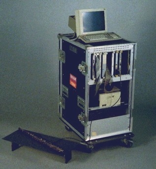 

Sogitec 4X

### IRCAM Signal Processing Workstation (ISPW)

1989年、4Xは、NeXTコンピュータにIRCAM Signal Processing Workstation (ISPW)という専用ボードを積んだ状態のマシンに移植され「Max」と命名されました。これでIRCAM以外の施設でも使用できるようになったものの、ISPWボードはとても高価なもので、当時は限られた研究機関などでのみ使用できる状態でした。

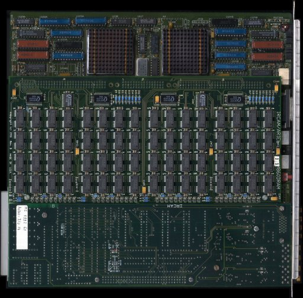 

IRCAM Signal Processing Workstation

### Maxの商用化 - Max/MSPへ

1989年、Maxは商用のアプリケーションとして、Opcode社にライセンスされます。当初の商用版のMaxはリアルタイムの音響合成をすることはできず主にMIDI情報を処理するためのビジュアルプログラミング言語として使用されていました。商用版のMaxのライセンスは、後にDavid Zicarelliが設立したCycling '74社に売却され現在も開発が継続しています。David Zicarelliは、MaxにMSPと呼ばれるリアルタイムの信号処理機能を加え、現在ではMax/MSPとして販売されています。

### Pdの誕生

David Zicarelliによる商用のMaxの開発とは別に、Miller Pucketteは完全に設計しなおしたフリーソフトとして、1996年Pure Data (Pd)をリリースします。Maxでは当初信号処理は専用のボード(ISPW)に依存していたのとは対照的に、Pdでは最初から信号処理など全ての計算はCPUで行なわれるよう設計されました。また、オープンソースとして公開されたため多くの環境に移植され、現在では、Mac OS X、Windows、Linux、iOS、Androidなど様々な環境で動作します。

## Pdの2つのバージョン

Pdのダウンロードページに行くと、2つのバージョンがあることに気付くと思います。この2つのバージョンは「Pd-vanilla」と「Pd-extended」と呼ばれて区別されています。

* [puredata.info > Downloads](http://puredata.info/downloads)

この2つのバージョンのPdは以下のような構成となっています。

* Pd-vanilla: 通常版Pd - Miller Puckette氏自身により開発が続けられている、音響合成のコアの部分のみのバージョン。
* Pd-extended: 拡張版Pd - 世界中の開発者によって開発されている、拡張版のPd。GUI、映像処理、物理演算、ハードウェアの制御など様々な機能が付加されている。

このワークショップでは、最終的にArduinoと接続して「楽器」の製作を目指します。ですので、必ず「Pd-extended」をインストールしてください。今後の解説も「Pd-extended」を前提に進めていきます。

## Pdの基本操作

### Pdを起動する

まずPd-extendedのアイコンをクリックして、Pdを起動してみましょう。プログラムの起動が完了すると、ウィンドウが表示されます。

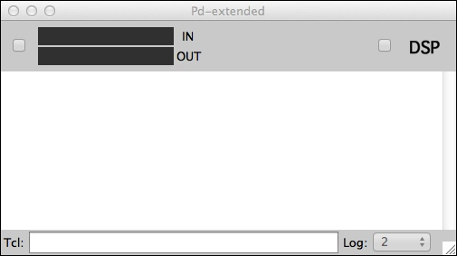

このウィンドウは「Pdウィンドウ」と呼び、様々な情報を表示します。また音のon/offもこのウィンドウで行うことができます。

#### ピークメーター

ウィンドウの左上にあるトグルスイッチをonにすると入力と出力の音量がメーターで表示されます。このメーターで音量が振り切っていないか(クリッピング)を確認することが可能です。

#### DSPトグルスイッチ

画面右上のトグルスイッチで、音響処理のON/OFFを切り替えることが可能です。このトグルスイッチは、ショートカットキーでも切り替え可能です。

* ⌘ + / : ON
* ⌘ + . : OFF

#### コンソール

ウィンドウ下部の白い領域は「コンソール」と呼ばれ、プログラムのエラーメッセージを表示したり、プログラムの状態をモニターすることが可能です。またプログラムからメッセージを表示することなども可能です。

## 新規パッチの作成

メニューの「File」> 「New」もしくは、「⌘ + n」キーで新規のファイルを作成します。すると空白のウィンドウがひとつ表示されます。これはPdの空のプログラムです。Pdではこのウィンドウの中にプログラムを作成していきます。

Pdでは、プログラムのことを「パッチ(patch)」と呼ぶ習慣があります。これは、アナログシンセサイザーなどの時代にはプログラムすることはパッチケーブルというケーブルでシンセサイザーの各モジュールを接続することが「プログラム」だったことから派生しています。今後「パッチ」という言葉が出てきたらプログラムのことと理解してください。

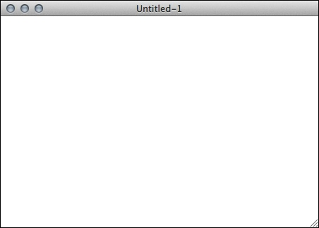

## オブジェクトの配置、"Hello World"

Pdのプログラムは、このパッチの中に「オブジェクト」と呼ばれるプログラムの構成単位を配置することで行います。このオブジェクトを画面上でブロックのように組み上げていくことで、プログラムが作成されていきます。この操作が、例えばProcessingなどのようなテキストによるプログラミング環境との大きな違いとなります。

では、ひとつオブジェクトを配置してみましょう。オブジェクトの配置はメニューバーの「Put」以下にまとめられています。

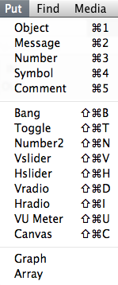

新規に作成したパッチウィンドウを選択した状態で、「Put」> 「Object ⌘1」を選択してみましょう。画面に点線で囲まれた小さな四角形が表示されます。

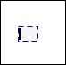

次にこの点線の箱の中にカーソルをあわせ、「print」という文字を入力してみてください。入力し終えたら、ウィンドウ内の点線のボックス以外の領域を一度クリックします。すると点線だったボックスが実線に変化し、上に小さな接続口のようなものが表示されます。これでオブジェクトの配置は完了です。

次に別の種類のオブジェクトを追加してみましょう。「print」オブジェクトの上に、「Put」>「Message ⌘2」を選択してメッセージオブジェクトを追加します。メッセージオブジェクトを追加したら、中に任意のメッセージを入力します。例えば「Hello Pd!」と入力してみましょう。

最後にこの2つのオブジェクトを接続します。「Hello Pd」と入力したメッセージボックスの左下にある接続口にカーソルを近づけるとカーソルが「丸」になる瞬間があります。このタイミングでクリックします。するとボックスから線が伸びてきます。この線を「パッチケーブル」と呼んでいます。そのままドラッグして、今度は「print」を入力したオブジェクトの左上の接続口にマウスカーソルを重ねます。するとまたマウスカーソルが丸になる瞬間があるので、ここでマウスボタンを離します。すると、上下に「パッチケーブル」が接続されます。

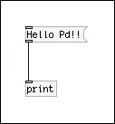

この、「オブジェクトを配置」 → 「パッチケーブルを接続」という操作がPdでのプログラミングの基本です。

ではこのパッチをテストしてみましょう。Pdのパッチは編集しているモードのままでは動作しません。現在このパッチは「編集モード」にあります。これを動作させるには「Edit」→「Edit Mode」を選択してチェックを外すか、「⌘ + E」キーで編集モードを解除します。

編集モードを解除したら、「Hello Pd」のメッセージボックスをクリックしてみましょう。するとコンソールに「Hello Pd」のメッセージが表示されるはずです。

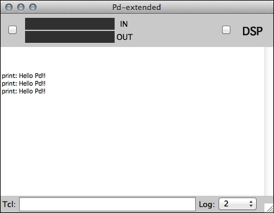

## もう少し複雑なパッチ、四則演算

では次に、オブジェクト「Object ⌘1」と、ナンバーオブジェクト「Number ⌘3」を組み合わせて、以下のようなパッチを組み立ててみましょう。

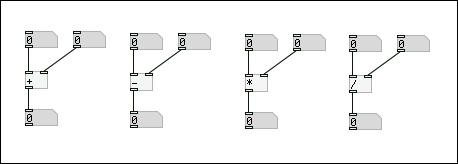

パッチが完成したら、編集モードを解除して、実際に操作しながらその動作を確認しながら考察してみましょう。

* 数字を変更するにはどうすれば良いか?
* 計算結果は正しく出力されたか?
* 左側の数字を変更したときと、右側の数字を変更したときの動作の違い
* もう少し複雑な計算をするパッチを作成してみる

## インレットとアウトレット

オブジェクトの上下に出現する接続のためのポッチは正式には「インレット」「アウトレット」と呼びます。オブジェクトの上に出現する入力のための口を「インレット」、下に出現するデータの出力のための口を「アウトレット」と呼びます。また、インレット、アウトレットともに左から「第１、第2、第３」というように数えていきます。

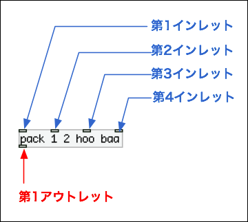

## オブジェクトの種類

ここまでで、3種類のオブジェクトが登場しました。「オブジェクト (Object)」「メッセージ (Message)」「ナンバー(Number)」。Pdではこの他にも様々な種類のオブジェクトが存在します。これらのオブジェクトは大きく分けて次の4種類に分類できます。

* オブジェクト(Object Box)
* メッセージ(Message Box)
* GUI(GUI Box)
* コメント(Comment Box)

### オブジェクト

箱の中に書き込むテキストによって、様々な機能を実現することが可能な汎用的なボックスです。例えば「+」オブジェクトは足し算、「random」オブジェクトは乱数の生成というように、数多くの機能がPdでは定義されています。またオブジェクトには「チルダ(~)」が末尾に付いているものと、そうでないものの2つに大別されます。例えば「osc~」などはチルダ付きのオブジェクトです。チルダの付いたオブジェクトは、音のデータを生成・加工を行います。末尾の「チルダ(~)」から音の波形を連想するとわかり易いかもしれません。

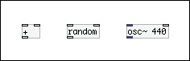

### メッセージ

メッセージはオブジェクトと良く似ていますが、右側の上下の角が尖っています。オブジェクトと形は良く似ていますが、その機能は全く異なります。
メッセージは特定の「メッセージ」をオブジェクトに送ります。オブジェクトに対する命令を送る機能とも考えられます。また一般的なプログラム言語の変数のような役割もはたします。変数と同様にメッセージにはいくつかの型(種類)が存在します。

* bang - オブジェクトに対して動作の開始の「きっかけ」を送る。具体的な数値やメッセージが必要の無い場合に使用される。
* float - 小数点以下の値のある数値「-1」「10」「12.34」「3.14159」「-110.13」など。
* symbol - 文字列。オブジェクト側で文字列を理解して、特定の機能を実行する。「read」「start」「stop」など。
* list - floatやsymbolがひとまとまりになったメッセージ「10 hello 0.3 -1.0」「0 foo baa hoge」など。
* pointer - データ構造をとりあつかう場合の特殊なメッセージ。

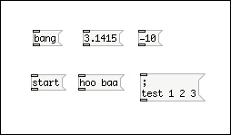

### GUI

GUIは、様々なユーザインタフェイスを実現するためのオブジェクトです。トグルボタンやラジオボタン、スライダー、スイッチなどの入力のためのGUI、VUメーター、LEDなど視覚的なフィードバックを得るためのGUIなどが存在します。

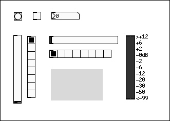

## Pdの処理の順番

以下のようなパッチを組んでみましょう。上のbangを押すと、どのような順番でメッセージが出力されるでしょうか?

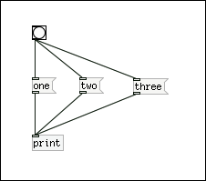

実は、「one」「two」「three」のメッセージが出力される順番は、パッチによって異なり、このパッチの外観だけでは出力の順番は判断できません。正確にはメッセージが処理される順番はパッチを作成した際のパッチケーブルを繋いだ順番によって決定されてしまいます(!!)

処理の順番によって結果が異ってしまうようなプログラムの場合、これは非常に困る挙動です。そのため、処理の順番を明示的に決めるオブジェクト「trigger」が存在します。triggerを経由したメッセージは、必ず右から左に向って処理されていきます。triggerオブジェクトの後ろには、メッセージの型に応じてその個数だけの記号をスペースで区切って記述します。

* b → bang
* f → float
* s → symbol
* l → list
* a → anything (何でもOK)

例えば、triggerの後で、「float float bang」という順番でメッセージを送りたい場合は「trigger f f b」となります。

順番に意味がある配線の場合には必ずtriggerを使うよう習慣付けましょう。たとえば、必ず「one、two、three」の順番で出力したければ以下のように変更すると良いでしょう。

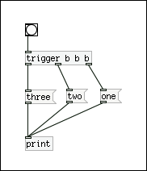

### 応用問題: 円の面積を求めるパッチを作成

では、応用問題として円の面積を求めるパッチを作成してみましょう。円の面積は以下の式で求められます。

* 円の面積 = 半径 * 半径 * π

順番としては、半径 * 半径を求める部分をまず先に作成し、その後でπ(3.1415...)をかけ算してみましょう。処理の順番を確定するためにtriggerを使うように心掛けます。

#### 答

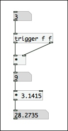

## コンピューターで音を扱かうということ

### 音を扱う ―音とは何か

まずはじめに、音を扱ってみたいと思います。Pdを利用して音響を生成したり再生する前に、まずはそもそも音とは何か、どうしたら音をコンピュータで扱うことができるのかといった基本的な部分から考えてみましょう。

音とは「振動」です。物を叩いたり、弦を弾いたりして、振動している場所から音は発生します。この振動は「音波」という言葉からも連想されるように空気中を伝わる「波」として耳に届きます。ただし波といっても、海岸に押し寄せる波のように、空気が上下に振動しながら空間を動いているわけではありません。音波は「疎密波」といって、振動によって生まれた空気の密度が濃い部分と薄い部分の繰り返しが空気中を伝わってくるのです。海の波を「横波」とすると、音は振動が波の進行方向と同じ方向である「縦波」と考えられます。

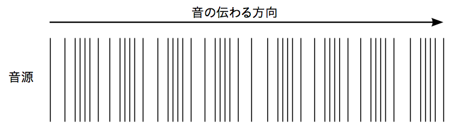

この空気の密度を縦軸に時間を横軸にとって、その変化をプロットしたものが「波形」と呼ばれるものです。波形はその形状の違いによって音色の違いを生み出します。また、波形の周期が短いほど高い音になり、波形の振幅が多いほど大きな音量になります。1秒間に音が何回周期を持つかという単位を周波数といい、Hz（ヘルツ）という単位で表します。例えば、440Hzは1秒間に440回の周期がある音の高さを表します。人間の耳は大体20Hzから20,000Hzまでを知覚できると言われています。

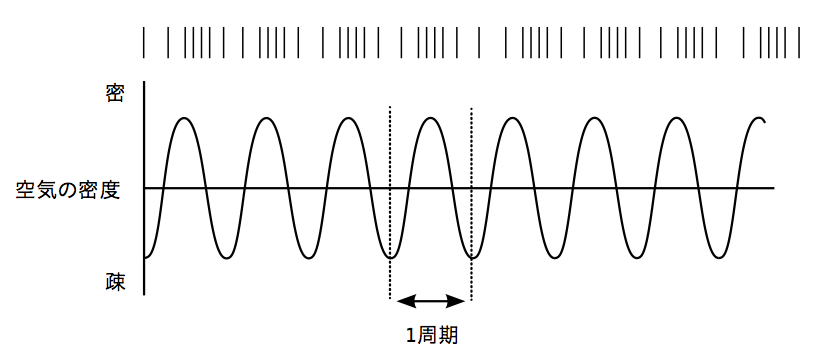

### コンピュータで音を扱うには

コンピュータは、波形の形状を記録して音として再生しています。ただし、コンピュータは連続するデータ（アナログデータ）をそのまま扱うことはできません。何らかの手段で数値の集合として変換しない限り、コンピュータはデータとして扱うことはできないからです。

コンピュータで音を扱う際には、音の波形を一定の時間間隔で区切って、その区切った時間ごとの波形の位置を記録して数値の集合に変換しています。この処理のことを「サンプリング」と呼びます。また、サンプリングを1秒間に何回行うのかという単位を、サンプリング周波数といいます。例えば、CDの場合は1秒間に44,100回サンプリングしています。また、DVDでは48,000回サンプリングしています。サンプリング周波数の数値が大きくなるほど、高周波の成分の音を記録することが可能となり、より高品質の音になると言えます。

コンピュータで音を再生する方法には、大きく分けて2つアプローチがあります。1つは全く何もない状態から波形の形状を計算して生成し、音として再生する方法です。この方法を「音響合成」といいます。もう1つの方向性は、現実世界の音をサンプリングして波形として記録し、その波形に編集や加工をしたうえで音として再生成するという方法です。この方法は「サンプリング＆プレイバック」と呼ばれます。もちろん、この2つの方法を組み合せることも可能です。

### ADCとDAC

コンピューターで音を処理する際に、マイクなどから入力されたアナログ信号をサンプリングしてデジタル情報に変換する装置を「ADC = Analog Digital Converter」と呼んでいます。またその反対に、デジタルで処理した音の波形を最終的にスピーカーで再生できるようアナログ信号に再変換する装置を「DAC = Digital Analog Converter」と呼びます。

Pdなどで音響を扱うということは、このADCとDACで挟まれたコンピューターのメモリの中で、音響情報を分析、加工、編集していることなのです。

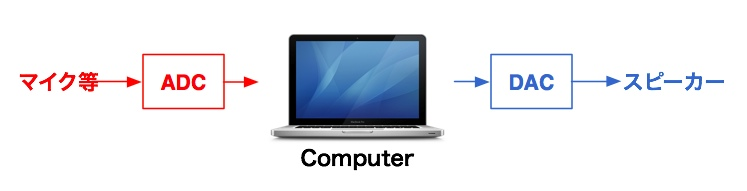

## Sin波を出してみる

## 波形を見る

## 音量を変更

## 2つのSin波を足す

## 波形を変更してみる

