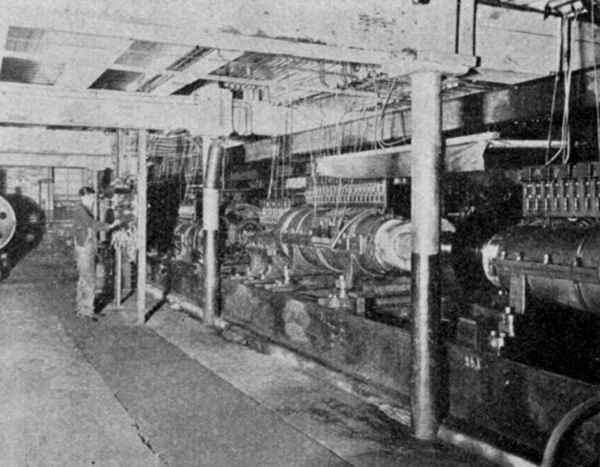
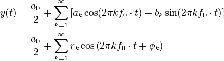
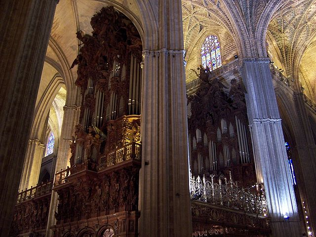
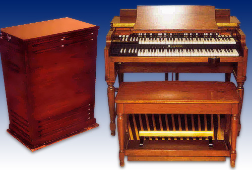
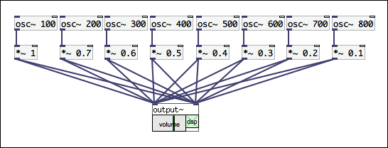
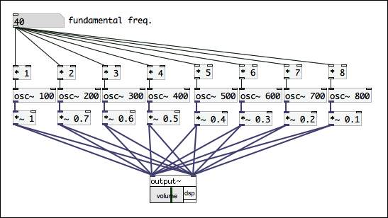

# 第2回: Pd入門2 – 音響合成、Pdでシンセサイザーをつくる

## 今日の内容

前回に引き続きPdの基本を学んでいきます。今回は「Pdでシンセサイザーをつくる」というテーマで進めていきます。

コンピューターが一般に普及する以前から、世の中には多くの電子楽器が存在し、その歴史は100年以上に及びます。そして、現在も進化を続けています。その歴史の中で、様々な音響合成(= 音色を合成する技術)が開発されてきました。

Pdは、音に関する汎用的なプログラミング環境なので、一つの音響合成の方式にとらわれることなく様々な音響合成を実際に音を聞きながら試していくことが可能です。このことで、音響合成に関する知識だけでなく、音や音色に関する理解も深まるのではないでしょうか。

### 参考: 世界最初の電子楽器「テレハーモニウム (Telharmonium)」

「テレハーモニウム」は、1897年サディウス・ケイヒル(Thaddeus Cahill)によって開発された、世界初の電子楽器です。重さ200トンにも及ぶ巨大なシステムで、電話網を通じて音楽を配信するという、その鑑賞方法も独特のものでした。

テレハーモニウムは、それより以前に存在していたオルガンを参考に、加算合成方式(後述)で音響合成していました。

* 動画: [Magic Music From The Telharmonium Documentary](http://www.youtube.com/watch?v=PPlbXl81Rs0)

## 音響合成1: 加算合成 (Additive synthesis)

「加算合成」とは、音の足し算による音響合成の手法です。

加算合成は「フーリエ級数展開」をその合成の論理的な基盤としています。フーリエ級数展開を簡単に説明すると「全ての周期的な波形は、基本周波数の整数倍のsin関数とcos関数の重ね合わせにより表現することができる」という定理です。この定理は、フランスの数学者ジョゼフ・フーリエによって熱伝導に関する研究の中で導入されました。

つまり、基本となる周波数の整数倍のオシレーターを無限(∞)に用意することができ、それぞれの音量を調整できるようにすれば、世の中の全ての周期的な波形を合成できるということを意味します。ただし、実際には無限の数のオシレータを用意することはできませんので、この理論を完全に再現することは困難です。

加算合成による音響合成の歴史は古く、オルガンに用いられている音響合成は加算合成を用いています。また前述したテレハーモニウムも加算合成によって音響合成していました。このオルガンの音響合成を電子的に再現した楽器には1934年にローレンス・ハモンドによって発明された「ハモンドオルガン」があります。

パイプオルガン

ハモンドオルガン

### Pdで加算合成 1 - 単純な加算合成

まず初めに、単純な加算合成を実現してみましょう。

100Hz、200Hz、300Hz、400Hz、500Hz、600Hz、700Hz、800Hzと100の整数倍のオシレータを8つ用意しています。また音量は倍音が高くなるにつれて少しずつ小さくなるように設定しています。最後にこれらを全て足し合わせて、output~に接続します。


実際に音を出してみると、オルガンのような音色が生成されます。単純ではありますが、加算合成が実現できました。

### Pdで加算合成 2 - 周波数を可変に

このままでは、常に同じ周波数しか鳴らすことができません。パッチに変更を加えて基本周波数(Fundamental Frequency)を変更できるようにしてみましょう。


### Pdで加算合成 3 - 様々な音色をランダムに生成

