# 第3回: Pd入門3 – サンプリング&プレイバック、グラニュラーシンセシス

前回の「音響合成、Pdでシンセサイザーをつくる」では、加算合成、減算合成、変調合成といった様々な音響合成について解説しました。これらは、全く無の状態から音響を生成していくアプローチでした。今回はこれとは逆のアプローチで、具体的な音をコンピューターにとりこんで(サンプリング)、それを加工しながら再生(プレイバック)するという「サンプリング&プレイバック」というアプローチについて取り上げます。

## サンプルファイルのダウンロード

今回の解説でとりあげた、Pdのサンプルは下記のGithubのリポジトリからダウンロードしてください。

* [サンプルファイルのダウンロード](https://github.com/tado/tamabi_ssaw13/tree/master/example/130506)

## サンプリングとは

サンプリング(Sampling)は「標本化」と翻訳されます。その意味は、連続信号(アナログ信号)を一定の間隔をおいて測定することにより、離散信号(デジタル信号)として記録することです。直感的に理解すると、連続する波を数値の並びに変換するイメージです。

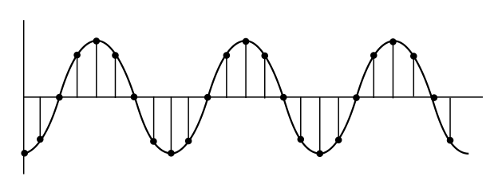

サンプリングするには、一定間隔でアナログ波形の値を測定する必要があります。この測定の時間間隔を「サンプリング周波数(Sampling rate)」と呼びます。サンプリング周波数は一般的にHzを単位にしてで記述します。例えばCDのサンプリング周波数は、44100Hz、つまり一秒間に44100個のサンプルを計測しています。DVDでは48000Hzでサンプリングしています。波形を正確に再構築するために信号帯域の2倍以上の速さでアナログ信号をサンプリングする必要があります。例えば、20000Hzまでを再現したい場合には、サンプリング周波数を40000Hz以上でサンプリング必要があります。この法則を「標本化定理(ナイキスト定理)」といいます。

また、信号をサンプリングする際に、信号の音量をどのくらいの細かさで計測するかという値を「量子化ビット数(Quantization bit rate)」と呼んでいます。量子化ビット数は、一般的に二進数の値、つまりビット(bit)で表現します。例えば量子化ビット数が8bitの場合には、表現できる細かさは、2の8乗、1024段階になります。16bitの場合は、2の16乗で65536段階となります。CDの量子化ビット数は16bit、DVDは24bitでサンプリングされています。

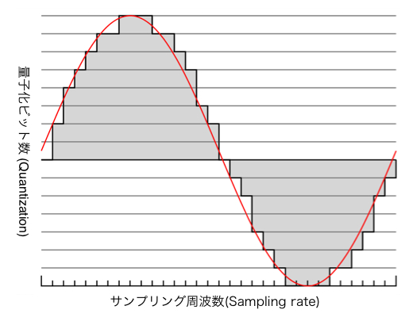

## サンプラー(Sampler)

パーソナルコンピューターの性能が現在のように発達していない頃は、サンプリングには「サンプラー」と呼ばれる専用のハードウェアを使用していました。サンプラーの歴史は比較的新しく、最初に一般に製品として販売されたサンプラーは、オーストラリアのフェアライト社が1979年に発表した「Fairlight CMI」です。当時の販売価格は1000万円以上するものでした。発売当初のサンプリング周波数は30.2kHz、量子化ビット数は8bitでした。1985年に発売されたシリーズIIIではサンプリング分解能を16ビット、サンプリング周波数を44.1kHzまで向上しました。その後、Synclavier、E-mu Systems、Akaiなど様々なメーカーからより安価なサンプラーが開発・販売され、音楽制作の現場で一般的に使用されるようになりました。

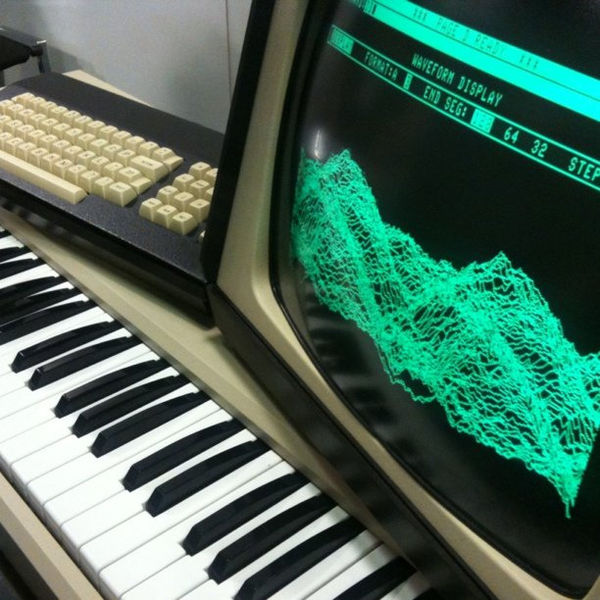

現在では、専用のハードウェアを用いることなくPC単体でサンプリングが可能となりました。こうしたPCベースのサンプラーは「ソフトウェア・サンプラー」と呼ばれます。Pdもソフトウェア・サンプラーとして使用することが可能です。さらに単に音を記録して再生するだけでなく、一度サンプリングした音を様々な加工変形して再生することが可能で、自由にプログラム可能なサンプラーとしてPdを捉えることもできるでしょう。

## Pdにサウンドファイルのデータをとりこむ

まずは、サウンドファイルから音のデータをPdにとりこんでみましょう。

Pdではサウンドデータを格納するためのデータ形式として、Arrayが用意されています。Arrayはその名前の通り「Array = 配列」として複数のデータ(リスト)を保持するだけでなく、その内容をグラフィカルに表示することも可能となっています。

### Arrayの配置

まず始めに、新規にパッチを作成し、「配置」→「アレイ」を選びます。するとまず「アレイプロパティ」が表示されます。この各項目を設定します。

* 名前(name): Arrayの名前を入力します。この名前が後からパッチ本体から参照されます。
* サイズ(size): Arrayが格納できるデータの数。例えば、44100Hzのサンプリング周波数で1秒の音を格納するには、44100のサイズが必要となります。
* 描画方法(Draw as): グラフの描画方法です。
* Arrayの格納先(Put array into): 「新しいグラフ」を選択すると、パッチにArrayが生成されます。

それぞれの項目を下記の図のような設定にして、Arrayを配置しましょう。

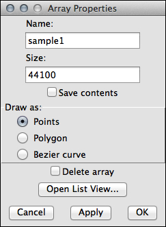

### Arrayにサウンドファイルのデータを読み込む

Arrayにサウンドファイルのデータを読み込むには、「soundfiler」オブジェクトを使用します。soundfilerオブジェクトにサウンドーデータを読み込むには、第1インレットにメッセージを入力します。メッセージは以下のような内容となります。

* read -resize《ファイル名》《Arrayの名前》

例えば、「glitch_loop.aiff」という名前のサウンドファイルを「sample1」と名付けたArrayに格納したければ、下記のメッセージを入力します。

* read -resize glitch_loop.aiff sample1

では、ここまでの内容を実際にパッチを組んでみましょう。下記のようになるでしょう。

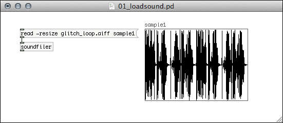

### Arrayの再生

次にこの格納したサウンドファイルを再生してみます。Arrayに読み込んだサウンドデータは、「tabplay~」オブジェクトを使用して再生可能です。tabplay~オブジェクトの属性に、Arrayにつけた名前を指定します。例えば、Array「sample1」に格納したデータを再生したいのであれば、下記のように指定ます。

* tabplay~ sample1

では実際に先程のパッチに再生機能を付加しましょう。Bangを送るとサンプルが再生されます。

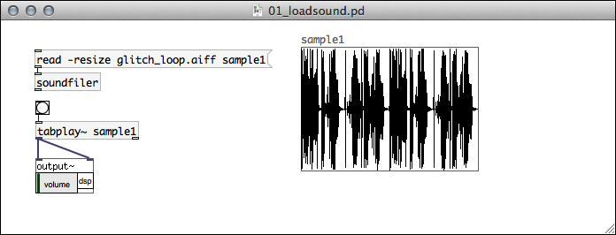

### 途中から再生、一部分だけを再生

この「tabplay~」オブジェクトに数値のメッセージを入力すると、指定した値のサンプルから再生を始めます。また、2つの数値をリストにして入力すると、指定した数値の範囲を再生します。下記のようにパッチを改造して試してみましょう。

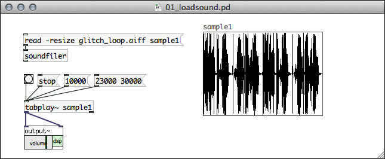

### ファイルの読み込みの工夫

次に、読み込むサウンドファイルを固定のファイルではなく、ファイルダイアログから自由に読み込めるようにしてみましょう。「openpanel」オブジェクトでファイルダイアログを表示することができます。このオブジェクトとreadオブジェクトを組合せると、自由にファイルを選択して読み込むことが可能となります。

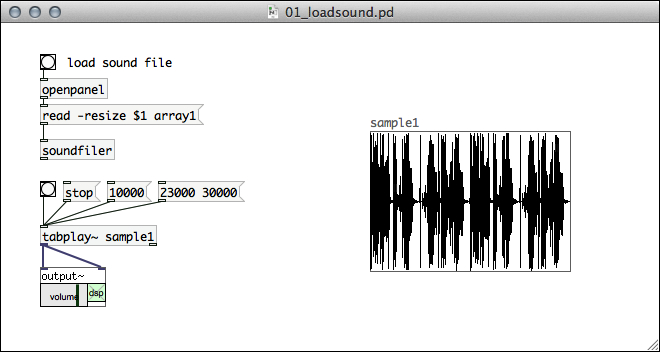

これで、サンプラーの基本機能、サンプリングとプレイバックの仕組みは完成しました。

## サンプラーの工夫1

さらにこのサンプラーをより「楽器」として使い易いように工夫してみましょう。

tabplay~オブジェクトは、再生位置や音量は変更できるものの、読み出しスピードなどは自由に変更できません。Arrayに読み込んだサンプルの読み出しスピードを変化させながら再生するには、「tabread4~」オブジェクトと「phasor~」オブジェクトを組合せます。

phasor~オブジェクトは、一定時間かけて0から1までの値に増加しまた0まで戻るという繰り返しを行います。この波形をサンプル読み出しの位置にします。tabread4~オブジェクトは、Arrayに格納されたサンプルから指定された場所を再生します。ここで先程生成したphasor~の波形を利用してループ再生をする仕組みです。

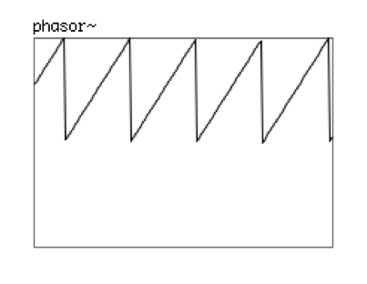

phasorの周波数を1にすると、等速再生します。1より小さな値の際はスロー再生、1より大きい場合はスピード再生となります。さらに、0以下の負の値ではリバース再生が可能です。

* phasorの周波数  1.0: 等速度再生
* phasorの周波数  0.5: 1/2の速度で再生(低音、スロー)
* phasorの周波数  2.0: 2倍速で再生(高温、ハイスピード)
* phasorの周波数 -1.0: リバース再生

この仕組みを先程のパッチに組み込んでみましょう。

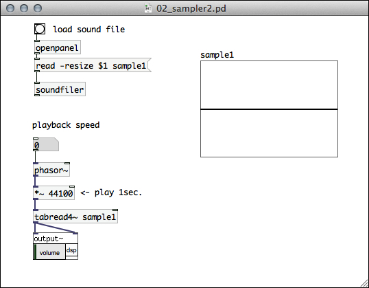

## サンプラーの工夫2

さらに、もう少し工夫してみましょう。水平スライダーを配置して、再生スピードをスライダーからコントロールできるようにしてみましょう。また、下記のパッチでは、サウンドファイルのサンプル数を計算して、自動的に全てのサンプルの範囲をくりかえすように工夫を施しています。

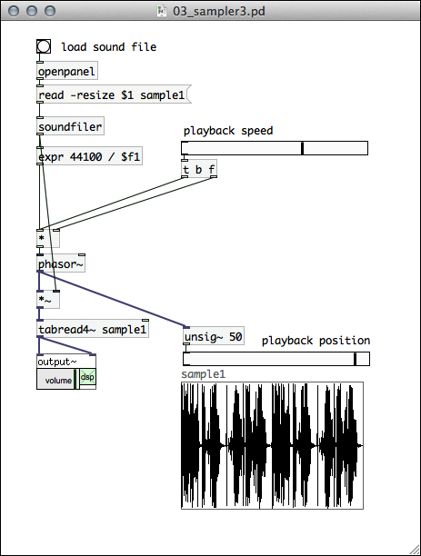

## サンプラーの工夫3

さらに様々な工夫をこらして、サンプルを再生する範囲とスピードを自由にスライダーから変更できるサンプルを作成しました。だいぶパッチが入り組んできましたが、やっている内容は再生位置の計算とその再生速度の調整です。

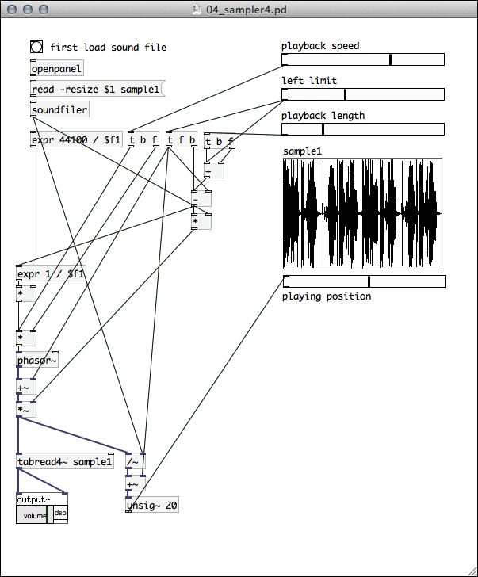

スライダーを操作すると、以下の内容がリアルタイムで変更可能です。

* playback speed: 再生スピード (-2.0 〜 2.0)
* left rimit: 再生開始位置 (0.0 〜 1.0)
* playback length: 再生範囲 (0.0 〜 1.0)

将来的には、これらのパラメータとセンサーを連動して、よりインタラクティブな「楽器」として完成させていきたいと考えています。

## グラニュラーシンセシス

グラニュラーシンセシス(Granular Synthesis)とは、非常に短かなスケールのサンプルを足し合せて音響合成する手法です。絵画で例えるなら、音の点描法とも言えるものです。音を構成する粒は1〜50msec程の長さで、この音の粒のことを「グレイン(Grain)」と呼びます。グレインの中にはSin波などの単純な波形を入れることもありますが、ここにサンプリングした波形から抽出した粒を用いると、とても興味深い音響の生成が可能となります。

グレイン

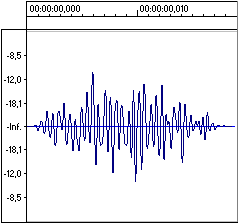

グラニュラーシンセシスのスコア(楽譜)の例。音の雲(Cloud of sounds)のデザイン。(Music and Computers - Chapter 4: The Synthesis of Sound by Computer Section 4.8: Granular Synthesis より引用)

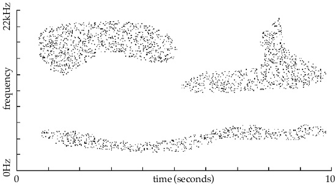

### グレインの生成

ここまでやってきたサンプリングをさらに応用して、グラニュラーシンセシスのためのパッチを作成してみましょう。ポイントは、どのようにしてグレインのエンベロープ(時間による音量変化)を生成するかという部分です。ここでは、phasor~オブジェクトの周波数と同期するcos~オブジェクトを用意し、その音量を0.0〜1.0の範囲で変化するように調整しています。その結果、cos波の波形がグレインのエンベロープとなっています。前回解説したAM変調の応用例とも言えるかもしれません。

では、まず基本となるパッチを作成してみましょう。まずはグレインの長さを20msで固定して、それに対応したcos~を生成しグレインの音を聞いてみましょう。再生開始位置(offset)を変更することで、グレインをとりだす位置を変更することも可能となっています。

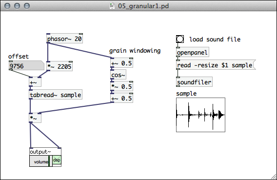

### グレインの長さを可変に

さらに、グレインの長さを自由に変更できるようにしてみましょう。グレインの長さを変更する際にphasor~の変化範囲を変更する必要があります。その値は

* サンプリング周波数 / グレインの長さ

で求まります。また、このサンプルでは、水平スライダーでグレインの長さとオフセットを調整できるように工夫してみました。

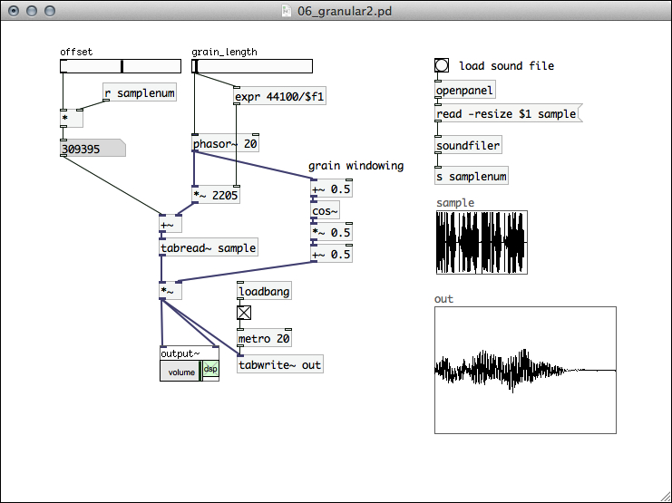

### グラニュラーシンセシスパッチの完成

最後により実践的なグラニュラーシンセシスのパッチを作成してみましょう。かなり複雑になってきましたが、このパッチでは先程のサンプルに加えて様々なパラメータをスライダーで操作できるようにしています。

* grain_length: グレインの長さ
* grain_pitch: グレインの周波数(ピッチ)
* pitch_range: グレインのピッチのばらつき
* play_speed: サンプルの再生スピード

色々なサウンドファイルを読み込んで、パラメータを変化させながらグラニュラーシンセシスの音のバリエーションを体感してみましょう。

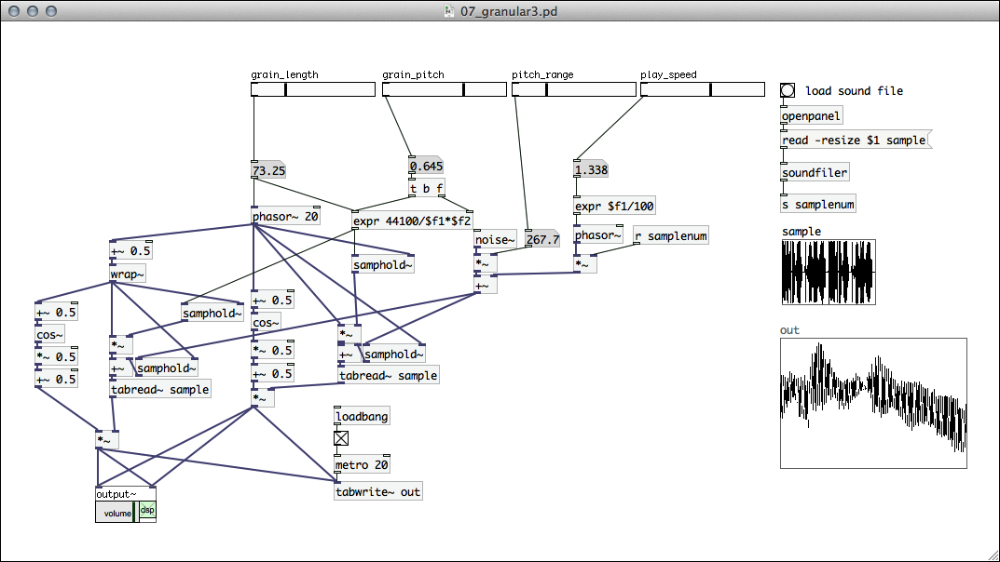

## まとめ

前回の音響合成と、今回のサンプリング&プレイバックで、Pdの入門編はひとまず完了です。次週からは、火曜日の授業と連携して、ArduinoとPdを接続し、Arduinoで読み込んだセンサーの値でPdをコントロールする方法について解説していきます。

