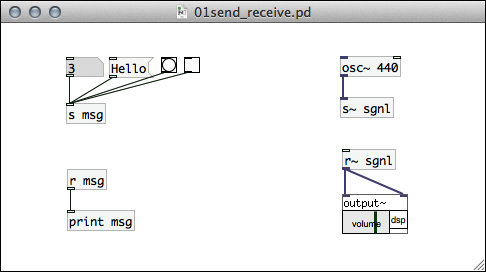
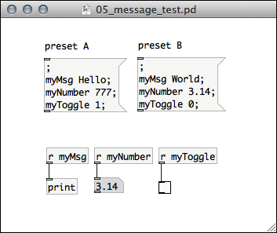
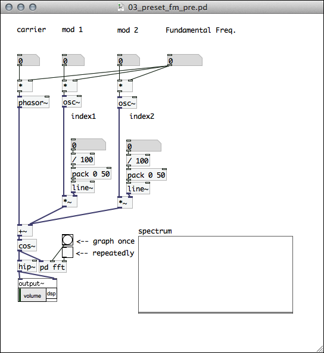
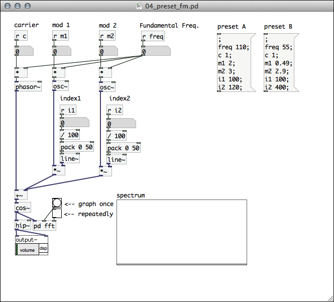
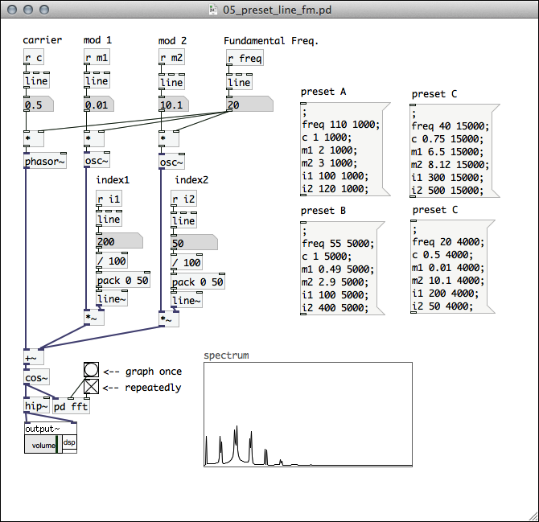
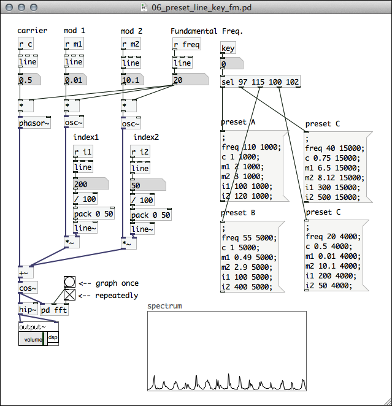

# PdとArduinoの連携 2 - Pduinoで音響合成

## 今日の内容

前回に引き続き、Pduinoを使用したArduinoとPdの連携を実践していきます。今回は最終課題の制作の参考となるよう様々なサンプルを紹介しながら最終課題のための主にソフトウェア側の作成の考え方について、解説していきます。

### Pdの機能の補足

Arduinoとの連携の解説に入る前に、まず課題制作のために役立ちそうな、PdのいろいろなTipsについて補足説明します。Pdも様々な工夫をすることで効率的にプログラミングが可能になったり、発表の際のセットアップの手間が省けたりします。細かなテクニックを身につけて便利にプログラミングしていきましょう。

## プリセット

これまで扱かったパッチは、スライダーやナンバーボックスの数値を設定しても、一度パッチを閉じて再度開くと設定した値はまた初期化されてしまいました。今後パフォーマンスでPdのパッチを使用したりする場面を想定すると、パッチを開いてから時間をかけてパラメーターを設定することができない状況が多々あるでしょう。

多くのパラメータを一度に記憶するための手段として「プリセット」機能があります。プリセットを使えば複数のパラメータを記憶して一度に呼び出すことが可能です。

### 復習: sendとreceive

sendとreceiveについて復習します。sendとreceiveは対として使用して、パッチケーブルを接続することなく数値、メッセージ、bangなどの値を送受信できる仕組みでした。また、シグナルを送受信する際にはsend~とreceive~を使用します。sendとreceiveはそれぞれ「s」「r」、send~とreceive~は「s~」「r~」と省略して記述可能です。

### メッセージボックスでプリセットをつくる 

まず初めに、メッセージボックスを使用したプリセットの例をとりあげます。

メッセージボックス内で以下のような書式にすると、送信先のreceiveの名前を指定してメッセージを送出することが可能となります。

	; 送信先receive名 メッセージ

また、この書式を複数記述して、複数のメッセージを一斉にreceiveオブジェクトに向けて送出することができます。

	; 
	送信先receive名1 メッセージ1;
	送信先receive名2 メッセージ2;
	送信先receive名3 メッセージ3;
	...

では、メッセージボックスを使用したパラメーターの一斉送信の簡単なサンプルを作ってみましょう。例えば下記のように様々な種類の値をそれぞれのreceiveオブジェクトに向けて送出ができています。

### プリセットをパッチに適用する

では、次に音響合成をするパッチにプリセットを適用してみましょう。例として以前とりあげたFM合成のパッチを使用します。プリセットを適用する前は以下ような状態です。

ここにプリセットでパラメータを設定するためには、以下のような手順でプリセットを追加します。

* プリセットを設定するパラメータへそれぞれreceiveオブジェクトを配置して名前をつける
* それぞれのreceiveに送出するメッセージボックスを配置
* 複数のセットがある場合は、その数だけメッセージボックスのセットを配置する

この手順で以下のようなパッチが完成しました。

### パラメーターを徐々に変化させる

プリセットを適用したパッチに少し工夫を加えることで、パラメーターの値が徐々にゆるやかに変化するようにすることが可能です。

各receiveオブジェクトの下にlineオブジェクトを配置します。これで指定した時間で徐々に値が変化するようになります。ここにpresetから値を送る場合には以下のようなメッセージに変更します。

	; 
	送信先receive名1 メッセージ1 経過時間1;
	送信先receive名2 メッセージ2 経過時間2;
	送信先receive名3 メッセージ3 経過時間3;
	...

経過時間の単位はミリセカンド(ms)で指定します。1000ms = 1sec になります。

この変更を加えたパッチは、例えば以下のようになるでしょう。

### キーボードでプリセットを切り替える

さらに工夫をして、キーボードからの入力でプリセットが切り替わるようにしましょう。

keyオブジェクトはキーボードからの入力をasciiコードで出力します。これをselオブジェクトを使用して特定のキーが入力された際に反応するようにしてみましょう。

例えば、以下のパッチでは、[a][s][d][f]のキーで、それそれ4種類のプリセットを選択するようにしています。

## サブパッチ

